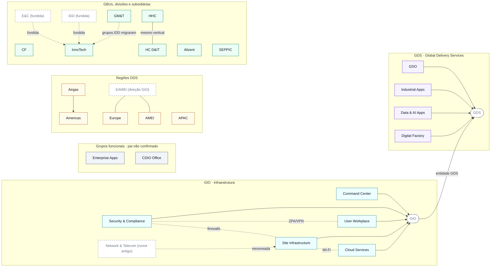

# Atlas de entidades do Alumen

Referência das entidades para as quais o Alumen liga projetos: as service lines da GIO e as entidades DDS (Digital Delivery Services). Para cada uma: o que faz, a que grupo pertence, onde termina, que nomes antigos ainda aparecem nos documentos e quanto o Alumen já a usa.

- **Versão viva, dentro do Alumen:** `/atlas`. Gerada do catálogo e do banco, com
  busca que cobre nome, sinal e nome antigo. Aberta a qualquer usuário logado.
  (Havia um artifact em claude.ai, inalcançável da rede corporativa.)
- **Situação em:** 14/09/2026, depois da Fase A.
- **Fontes:**
  - definições atuais de `src/lib/target-catalog.data.json`;
  - decisões do negócio registradas em `PLAN_PROMPTS_CATALOG_REVIEW.md` §3.1;
  - contagens medidas no `cioo.db` de produção em 14/09/2026 (306 projetos, 69 extrações de Goals, 181 claims, 408 impactos).
- **Regra deste documento:** sem nomes de pessoas. Organogramas ficam desatualizados e não ajudam a classificar impacto.

> ⚠️ **Este documento é um retrato de 14/09/2026, anterior à Fase C.** Ele já
> envelheceu no que prometia: diz que o catálogo "ainda tem o texto antigo" e que
> três correções de sigla ficam para a Fase C — as duas coisas deixaram de valer
> quando a Fase C foi executada, no mesmo dia.
>
> **Para consulta, use `/atlas`**, que é gerado do catálogo e do banco e não
> envelhece. Este arquivo fica como registro do raciocínio e das decisões de
> negócio que originaram o modelo.

---

## 1. Mapa

Linha contínua com seta = hierarquia · tracejada com seta = renomeação ou fusão · pontilhada sem seta = fronteira · contínua sem seta = coordenação · caixa tracejada = nome antigo ou agrupamento que não é alvo de impacto.

---

## 2. Entidades

**Colunas de uso** (medidas em 14/09/2026):

- **Donos:** projetos da planilha CDIO cuja entidade dona é esta, somando grafias que são o mesmo valor.
- **Claims:** ligações evidenciadas extraídas pelo Goals. Desde a Fase A, cada claim vira exatamente uma linha de impacto GIO/DDS, então este número também é o de impactos da entidade.
- **Touched:** projetos que marcam a entidade como afetada.

### 2.1 GIO · Global Infrastructure Operations

Organização de infraestrutura e operações do Grupo, em cinco service lines. **É entidade GDS.** Na planilha CDIO é dona de 28 projetos, mas **não é alvo de impacto**: impactos na GIO vão para as service lines (§3.1, itens 1 e 7).

| Service line | O que faz | Donos | Claims | Touched |
|---|---|---:|---:|---:|
| **Security & Compliance** | Projeta, constrói e opera as soluções de segurança do Grupo: identidade e acesso (CARM, AdminPass/PAM); segurança de rede e acesso remoto (SWG, SSE, Zscaler ZPA, que substitui o VPN Ivanti); segurança de nuvem (Prisma Cloud → Cortex Cloud/XSIAM); proteção de aplicações (WAAP); hardening e conformidade (GT04, Qualys); PKI e certificados (Sectigo); gestão de vulnerabilidades; arquitetura de segurança; CSIRT. | 0 | 42 | 41 |
| **Command Center** | Hub transversal (antigo GOPs) que monitora e coordena as operações digitais 24/7: gestão de incidentes maiores, observabilidade e monitoramento, orquestração de serviços (SIAM), qualidade de dados e CMDB, AIOps e automação. | 0 | 1 | 2 |
| **User Workplace** | O ambiente digital dos colaboradores: PCs, dispositivos móveis, videoconferência, Google Workspace, lojas de aplicativos corporativas, suporte local e remoto. Iniciativas: gestão de dispositivos em nuvem (Modern Management), impressão gerenciada, portal de autoatendimento, automação ServiceNow. | 0 | 10 | 13 |
| **Site Infrastructure** | Fundações digitais físicas e locais de cerca de 3.000 sites: LAN, WAN, Wi-Fi, Cisco ISE, firewalls de site (regras de WAN e borda) e computação local. **Antes chamada GIO Network & Telecom.** | 0 | 7 | 8 |
| **Cloud Services** | Estratégia e ambiente multi-cloud (AWS, GCP): framework padronizado, automatizado e seguro de implantação, FinOps, políticas de segurança para contas de serviço. No roadmap: Cloud Center of Excellence, conectividade entre nuvens e on-premise, containerização por padrão, backups com soberania de dados. | 0 | 20 | 22 |

### 2.2 GDS · Global Delivery Services (também GDDS)

O modelo e grupo guarda-chuva que centraliza as fábricas de desenvolvimento e as operações digitais transversais. **É agrupamento, não alvo de impacto.** A GIO Account Factory lista como entidades GDS: GDO, Industrial Apps e GIO (§3.1, itens 1 e 10).

| Entidade | O que faz | Donos | Claims | Touched |
|---|---|---:|---:|---:|
| **GDO** (Global Data Operations) | Entidade operacional de dados dentro de GDS. | 7 | 8 | 12 |
| **Industrial Apps** | Trabalha com a Direção Industrial na definição dos roadmaps técnicos de produto. | 15 ¹ | 7 | 11 |
| **Data & AI Apps** | Estratégia de dados e produtos de inteligência artificial. | 6 ² | 5 | 7 |
| **Digital Factory** | Motor de entrega: desenvolvimento ágil e escala de produtos digitais. | 0 | 0 | 0 |

¹ Na planilha, grafado "Indutrial Apps".
² 3 grafados "Data & AI Apps" e 3 grafados "Digital & AI".

**Atenção com GDO:** a sigla aparece nos documentos de 64 dos 69 projetos analisados. Ser citado não é ser impactado.

### 2.3 Grupos funcionais (pai não confirmado)

| Entidade | O que faz | Donos | Claims | Touched |
|---|---|---:|---:|---:|
| **Enterprise Apps** | Soluções digitais para os processos corporativos que atravessam o Grupo. | 6 ³ | 8 | 15 |
| **CDIO Office** (Office of the Chief Digital & Information Officer) | Define a visão e a governança de Digital & IT do Grupo. | 6 | 2 | 4 |

³ Na planilha, grafado "Entreprise Apps".

### 2.4 Regiões DDS

| Entidade | O que faz | Pai | Donos | Claims | Touched |
|---|---|---|---:|---:|---:|
| **Americas** | Hub regional de North America (NAM), Argentina (ARG) e Latin America (LATAM). | — | 53 | 13 | 20 |
| **Airgas** | Mercados de gases industriais e medicinais. Integrada à estrutura de Americas: DRMT de Americas, MyHR (Workday) junto com LATAM, compras digitais pelo Americas Procurement Center. | **Americas** | 18 | 10 | 21 |
| **Europe** | Hub regional organizado nos clusters de negócio **CE** (Central Europe), **SWE** (South-West Europe) e **NEC** (North-East Europe), que regem faturamento, carteira de clientes e portfólio de TI. | — | 47 | 11 | 22 |
| **AMEI** | Hub regional de África, Oriente Médio e Índia. | — | 8 | 1 | 6 |
| **APAC** | Hub regional da Greater China (GCH) e do restante da Ásia-Pacífico. | — | 27 | 8 | 13 |

**Airgas e Americas:** um claim em Airgas não gera um segundo claim em Americas; a soma é feita na agregação. Hoje, 13 dos 21 projetos que marcam Airgas não marcam Americas (§3.1, item 2).

**EAMEI não é entidade DDS.** É a direção regional da GIO que cobre Europe e AMEI com liderança unificada; abaixo dela, a entrega é separada por escopo. Um documento que diz "EAMEI" só marca as duas regiões quando o escopo for a região inteira. Caso contrário, marca a que o texto identificar por país ou site. Os clusters de entrega da GIO (França; Norte e Sudoeste; Central e Leste) **não** definem DDS Europe (§3.1, itens 5 e 11).

### 2.5 GBUs, divisões e subsidiárias

| Entidade | O que faz | Donos | Claims | Touched |
|---|---|---:|---:|---:|
| **CF** (Corporate Functions) | Finanças, RH, Compras, Comunicação, Jurídico e Propriedade Intelectual. | 35 | 10 | 12 |
| **GM&T** (Global Markets & Technologies) | Divisão de negócio. Os grupos de TI de IDD que estavam sob GM&T migraram para InnoTech; o provedor BIS GM&T segue ativo por enquanto, então GM&T continua canônico. | 0 | 0 | 0 |
| **InnoTech** | GBU criada pela fusão de IDD e E&C (Fase 1 do projeto FIT, 17/03/2025). Desde o go-live da Fase 2 (14/09/2026), o provedor BIS E&C se chama **DDS InnoTech** e os grupos de TI usam o trigrama **DIN**. | 10 ⁴ | 3 | 5 |
| **HHC** (Home Healthcare) | O vertical Home Healthcare dos lados de negócio e de entrega: a GBU global (operações, excelência operacional, programas como TechCARE e Data Healthcare) e o provedor de serviços de TI **DDS HHC** (antigo BIS Home Healthcare, trigrama DHC). | 33 | 6 | 8 |
| **HC D&IT** (Healthcare Digital & Information Technology) | Função de governança tecnológica do vertical Healthcare: liderança de TI, validação de arquitetura, conformidade com os padrões globais de segurança e de compras de TI. | 0 | 2 | 2 |
| **Alizent** | Subsidiária de IoT industrial e rastreamento de ativos. | 0 | 6 | 8 |
| **SEPPIC** | Subsidiária de ingredientes especiais para saúde e beleza, mantida como entidade DDS própria. | 2 | 0 | 1 |

⁴ 7 grafados "InnoTech" + 3 grafados "E&C", que migram com o alias.

**Fundidas em InnoTech** (não são mais alvo): **E&C** (Engineering & Construction) e **IDD** (Innovation & Development Division). Os nomes continuam aparecendo em documentos antigos. Hoje ainda há 1 claim gravado como E&C (§3.1, item 4).

---

## 3. Hierarquias

| Filha | Pai | Base |
|---|---|---|
| Security & Compliance, Command Center, User Workplace, Site Infrastructure, Cloud Services | GIO | Service lines da GIO |
| GIO | GDS | Listada como entidade GDS pela GIO Account Factory (§3.1, item 1) |
| GDO, Industrial Apps | GDS | §3.1, item 1 |
| Data & AI Apps, Digital Factory | GDS | §3.1, item 10 |
| Airgas | Americas | §3.1, item 2 |
| Enterprise Apps, CDIO Office | **não confirmado** | O agrupamento da tela `/admin/catalog` é só visual |

GIO e GDS são agrupamentos: nenhum dos dois recebe claim ou impacto próprio.

---

## 4. Fronteiras

Quando um mesmo tema poderia pertencer a duas entidades:

| Tema | Pertence a | Não pertence a | Base |
|---|---|---|---|
| Acesso remoto: Zscaler ZPA, migração do VPN Ivanti (ZTNA) | Security & Compliance | User Workplace (no máximo, consome o rollout aos usuários) | §3.1, item 6 |
| Firewalls de site ou filial, regras de WAN, borda de site | Site Infrastructure | Security & Compliance | §3.1, item 9 |
| Gestão de vulnerabilidades corporativas, arquitetura de segurança, CSIRT | Security & Compliance | Site Infrastructure | §3.1, item 9 |
| Wi-Fi, LAN, WAN, Cisco ISE | Site Infrastructure | Cloud Services ("Wifi on the Cloud" é roadmap, não dono) | §3.1, itens 6 e 9 |
| Necessidades do negócio Home Healthcare; suporte e entrega de serviços de TI (DDS HHC) | HHC | HC D&IT | §3.1, itens 3 e 8 |
| Governança tecnológica de Healthcare: liderança de TI, arquitetura, padrões globais | HC D&IT | HHC | §3.1, itens 3 e 8 |
| Projeto em EAMEI | Europe e/ou AMEI, conforme o país ou site citado; as duas só se o escopo for a região inteira | "EAMEI" como entidade | §3.1, item 5 |

**Exemplo real:** o PRJ0019818 cita *"DDS HHC: support / Expertise on the interface between HHC solutions and Payroll"*. Pela regra, o alvo é **HHC**; o modelo gravou HC D&IT.

---

## 5. Nomes antigos e grafias

Tabela de consulta: o texto à esquerda, encontrado num documento ou na planilha, corresponde à entidade à direita.

| Texto encontrado | Entidade | Uso | Base |
|---|---|---|---|
| DDS InnoTech, BIS E&C, E&C, IDD | InnoTech | texto livre e campos estruturados | §3.1, itens 4 e 12 |
| DIN, BEC | InnoTech | **só** campos estruturados (trigramas) | §3.1, item 12 |
| DDS HHC, BIS Home Healthcare, Home Healthcare | HHC | texto livre e campos estruturados | §3.1, item 8 |
| DHC | HHC | **só** campos estruturados | §3.1, itens 8 e 12 |
| GIO Network & Telecom, GIO N&T | Site Infrastructure | texto livre e campos estruturados | §3.1, item 9 |
| GDDS | GDS | texto livre e campos estruturados | §3.1, item 10 |
| Indutrial Apps | Industrial Apps | planilha (erro de digitação) | `dds-catalog.ts` |
| Entreprise Apps | Enterprise Apps | planilha (erro de digitação) | `dds-catalog.ts` |
| Digital & AI | Data & AI Apps | planilha | `dds-catalog.ts` |
| EU | Europe | planilha | `dds-catalog.ts` |
| BGMT | **ainda não** | vira alias de InnoTech quando o provedor BIS GM&T for encerrado | §3.1, item 12 |

**Por que trigramas só em campos estruturados:** siglas de três letras colidem com outras coisas. "DIN", por exemplo, também é a norma técnica alemã.

**O que os documentos atuais usam** (projetos cujo texto contém a forma): "DDS \<entidade\>" 33 · "BIS \<entidade\>" 6 · "GDDS" 5 · "BIS Home Healthcare" 0 · trigramas 0.

**Siglas por extenso corretas:**

| Sigla | Por extenso |
|---|---|
| DDS | Digital Delivery Services |
| GDS | Global Delivery Services |
| GDO | Global Data Operations |

Três trechos do código ainda usam formas erradas: `prompts.ts:20` e `deep-dive-engine.ts:235` ("Digital & Data Solutions"), `catalog/page.tsx:39` ("Global Digital Services") e a descrição de GDO no catálogo ("Global Digital Organization"). A correção fica para a Fase C.

---

## 6. Como um projeto se liga a estas entidades

Cada claim do Goals liga um projeto a uma entidade, com um papel. **O papel descreve o que a entidade faz para o projeto.** A tela lê a relação a partir do projeto.

| Papel | Significado | Como a tela escreve | Claims |
|---|---|---|---:|
| `primary_provider` | A entidade fornece a capacidade, a infraestrutura ou a governança que o projeto consome. | "Projeto *depends on* entidade" | 89 |
| `regional_executor` | A entidade (uma região) executa o rollout do projeto. | "Projeto *requires coordination with* entidade" | 42 |
| `risk_owner` | A entidade é dona do risco ou da conformidade que o projeto afeta. | "Projeto *requires coordination with* entidade" | 32 |
| `downstream_consumer` | A entidade consome o que o projeto produz. | "Projeto *provides services to* entidade" | 13 |
| `blocked_by` | Uma decisão ou o estado da entidade bloqueia o projeto. | "Projeto *depends on* entidade" | 5 |

**Corrigido em 14/09/2026 (Fase A):** a tela escrevia `primary_provider` e `downstream_consumer` ao contrário ("Projeto *provides services to* Security & Compliance"). Agora `primary_provider` vira "depends on" e `downstream_consumer` vira "provides services to", e as 181 linhas foram regravadas.

---

## 7. Pendências

- O **pai** de Enterprise Apps e CDIO Office não foi confirmado.

---

## 8. Como manter e enriquecer

Ao receber um documento novo (texto colado, PDF, DOCX, XLSX, apresentação):

1. **Extrair** entidades, funções, hierarquias, fronteiras e nomes antigos.
2. **Comparar** com as decisões do `PLAN_PROMPTS_CATALOG_REVIEW.md` §3.1. Se o documento contradisser uma decisão, registrar o conflito e perguntar; não sobrescrever.
3. **Registrar** a decisão nova no §3.1, com fonte e data.
4. **Atualizar este md** e a versão interativa (mesmo link).
5. **Regras:** sem nomes de pessoas; sem marcadores de nota de rodapé colados ao texto; trigramas só em campos estruturados.
6. O `target-catalog.data.json` e os prompts só mudam quando a reescrita do catálogo (Fase C) for autorizada.

As contagens de uso são uma foto. Para atualizar, basta repetir as consultas somente leitura no `cioo.db`, com as mesmas definições do início do §2.

---

## 9. Histórico

| Data | Alteração |
|---|---|
| 14/09/2026 | Criação: entidades do catálogo atual, decisões do §3.1 (itens 1 a 12), contagens de produção, versão interativa publicada. |
| 14/09/2026 | Fase A aplicada: relação dos papéis corrigida na tela; 98 linhas de impacto órfãs removidas (506 → 408 impactos). A coluna "Impactos" saiu porque passou a repetir "Claims". |
